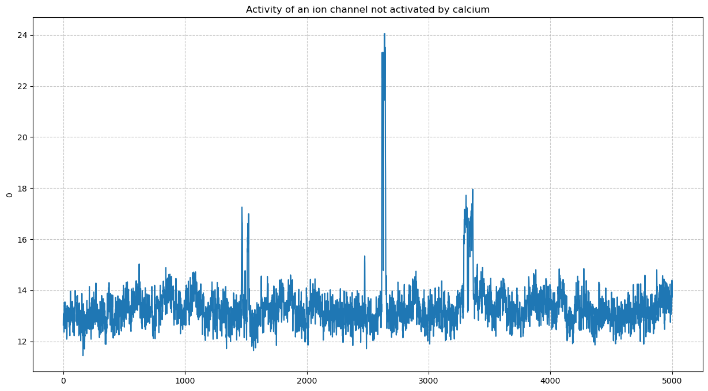
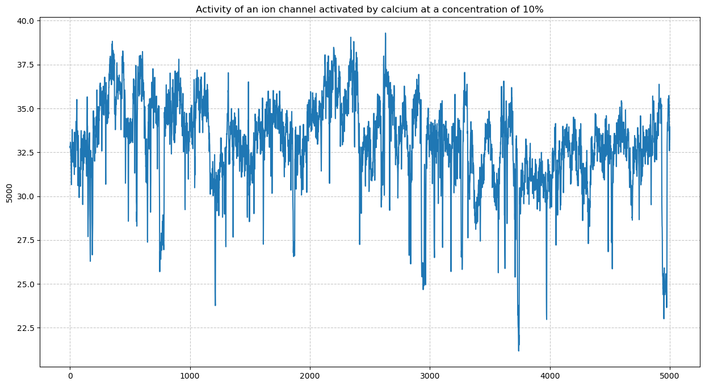
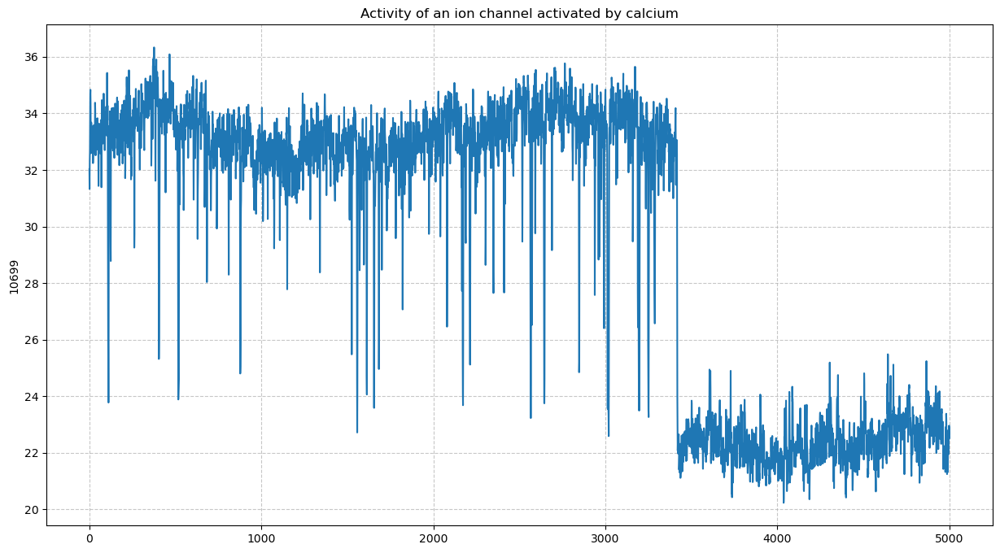
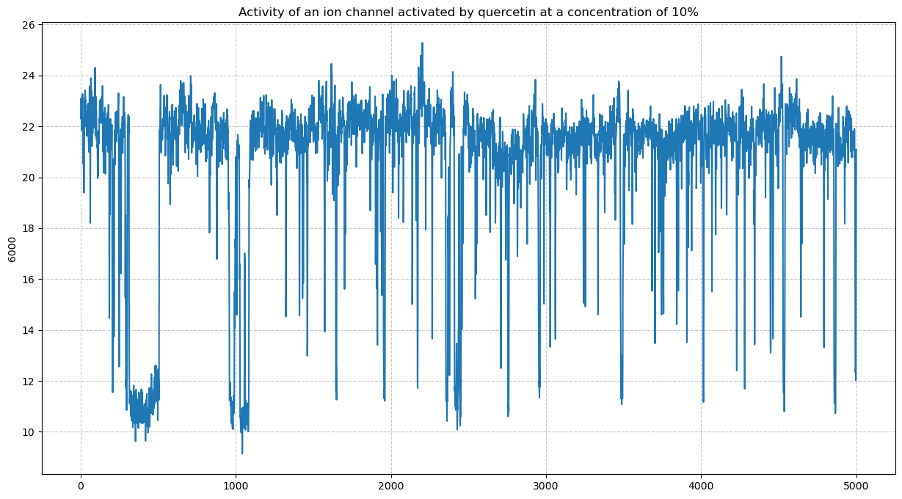
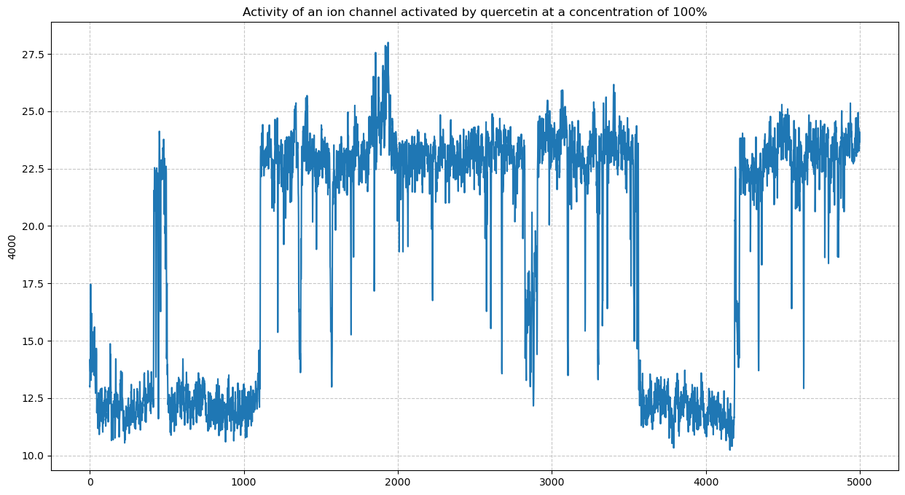
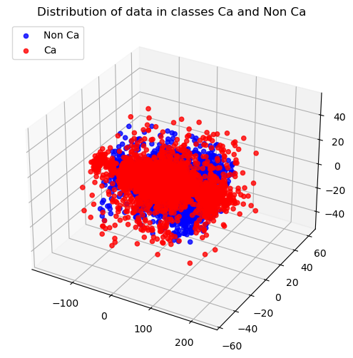
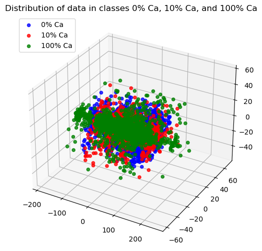
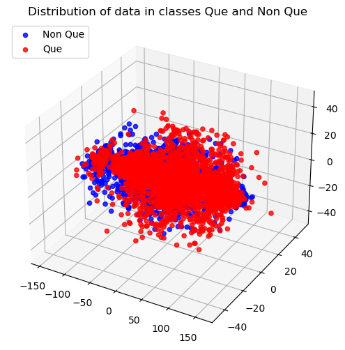
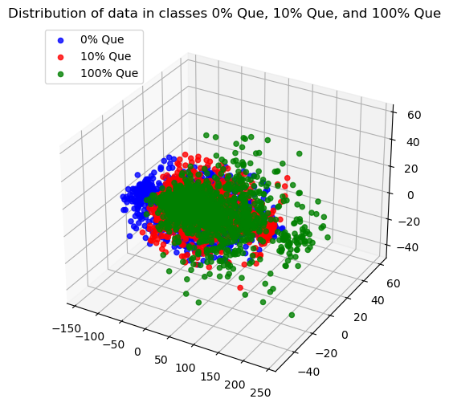

```python
import pandas as pd
import numpy as np 

import matplotlib.pyplot as plt
import seaborn as sns 

import plotly.express as px
import plotly.graph_objects as go

from modules.plots import draw_plot
from modules.classes_scatterplot import draw_classes_scatterplot
from modules.categorical_data_coding import code_data
```


```python
df_calcium_clf = pd.read_csv('./prepared_datasets/calcium_classification.csv')
df_calcium_concentration_clf = pd.read_csv('./prepared_datasets/calcium_concentration_classification.csv')
df_quercetin_clf = pd.read_csv('./prepared_datasets/quercetin_classification.csv')
df_quercetin_concentration_clf = pd.read_csv('./prepared_datasets/quercetin_concentration_classification.csv')
```


```python
draw_plot(df_calcium_concentration_clf.loc[0][0:5000],
          'Activity of an ion channel not activated by calcium')
```


    

    


```python
draw_plot(df_calcium_concentration_clf.loc[5000][0:5000], 
          'Activity of an ion channel activated by calcium at a concentration of 10%')
```


    

    


```python
draw_plot(df_calcium_concentration_clf.loc[df_calcium_concentration_clf.shape[0]-1][0:5000], 
          'Activity of an ion channel activated by calcium at a concentration of 100%')
```


    

    


```python
draw_plot(df_quercetin_concentration_clf.loc[6000][0:5000], 
          'Activity of an ion channel activated by quercetin at a concentration of 10%')
```


    

    


```python
draw_plot(df_quercetin_concentration_clf.loc[4000][0:5000], 
          'Activity of an ion channel activated by quercetin at a concentration of 100%')
```


    

    


```python
code_data(df_calcium_clf, 'target')
code_data(df_calcium_concentration_clf, 'target')
code_data(df_quercetin_clf, 'target')
code_data(df_quercetin_concentration_clf, 'target')
```


```python
draw_classes_scatterplot(df_calcium_clf.drop('target', axis=1), df_calcium_clf['target'],
                         "Distribution of data in classes Ca and Non Ca",
                         ["Non Ca", "Ca"], ["blue", "red"])
```


    

    


```python
draw_classes_scatterplot(df_calcium_concentration_clf.drop('target', axis=1), df_calcium_concentration_clf['target'],
                         "Distribution of data in classes 0% Ca, 10% Ca, and 100% Ca",
                         ["0% Ca", "10% Ca", "100% Ca"], ["blue", "red", "green"])
```


    

    


```python
draw_classes_scatterplot(df_quercetin_clf.drop('target', axis=1), df_quercetin_clf['target'],
                         "Distribution of data in classes Que and Non Que",
                         ["Non Que", "Que"], ["blue", "red"])
```


    

    


```python
draw_classes_scatterplot(df_quercetin_concentration_clf.drop('target', axis=1), df_quercetin_concentration_clf['target'],
                         "Distribution of data in classes 0% Que, 10% Que, and 100% Que",
                         ["0% Que", "10% Que", "100% Que"], ["blue", "red", "green"])
```


    

    


```python

```
